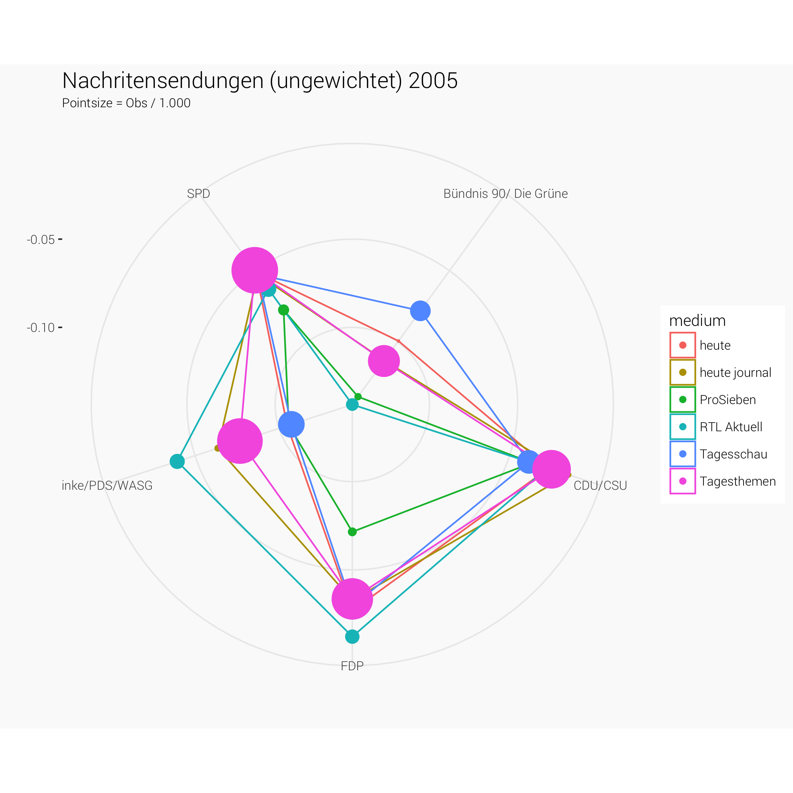

```{r message=FALSE, warning=FALSE, include=FALSE}
library(foreign)
library(tidyr)
library(ggplot2)
library(dplyr)
library(lubridate)
library(readr)
library(plotly)
library(scales)

# Theming
quartzFonts(
  Roboto =
    c("Roboto-Light",
      "Roboto-Bold",
      "Roboto-Regular",
      "Roboto-Thin")
)

theme_set(
  theme_bw(base_family = "Roboto", base_size = 10) +
    theme(
      plot.title = element_text(size = 14,
                                margin = margin(0, 0, 4, 0, "pt")),
      plot.subtitle = element_text(size = 8),
      plot.caption = element_text(size = 6),
      plot.background   = element_rect("#fafafa", "#fafafa"),
      panel.background  = element_rect("#fafafa"),
      panel.border = element_blank()
    )
)

rm(list=ls())
```

# Load Data

For details about data description see [here](https://github.com/franziloew/mediabias/blob/master/docs/mediatenor.Rmd)

```{r message=FALSE, warning=FALSE}
load(file = "../output/mediatenor.Rda")
```

## Line Plots

### Tageszeitungen

```{r}
df.reduced %>%
  filter(category == "daily_print") %>%
  ggplot(aes(year, count, color=medium)) +
  geom_line() +
  facet_wrap(~p_group) +
  labs(x="", y="", color="",
       title="Tageszeitungen: Anzahl d. Beobachtungen")
```

```{r}
p <- df.reduced %>%
  filter(category == "daily_print")

ggplot(p, aes(year, wertung, color=p_group, 
             group=p_group)) +
  geom_point(size=p$count/10000) + geom_line() +
  facet_wrap(~medium, ncol = 3) +
  geom_hline(yintercept = 0, color="grey10", 
             size=0.3, linetype = 2) +
  labs(x="", y="", 
       title="Tageszeitungen: Wertung (ungewichtet)", 
       subtitle = "Pointsize: Obs/10.000",
       color="") +
  theme(axis.text.x = element_text(angle = 90)) +
  scale_x_continuous(breaks = seq(min(df.reduced$year),max(df.reduced$year),2)) 
```

### Magazine und Wochenzeitungen

```{r}
df.reduced %>%
  filter(category == "magazine_print") %>%
  ggplot(aes(year, count, color=medium)) +
  geom_line() +
  facet_wrap(~p_group) +
  labs(x="", y="", color="",
       title="Magazine und Wochenzeitungen: Anzahl d. Beobachtungen")
```

```{r}
p <- df.reduced %>%
  filter(category == "magazine_print")

ggplot(p, aes(year, wertung, color=p_group, group = p_group)) +
  geom_point(size=p$count/10000) + geom_line() +
  facet_wrap(~medium, ncol = 5) +
    geom_hline(yintercept = 0, color="grey10", 
             size=0.3, linetype = 2) +
  labs(x="", y="", color="",
       title="Magazine und Wochenzeitungen: Wertung (ungewichtet)", 
       subtitle = "Pointsize: Obs/10.000")  +
  theme(axis.text.x = element_text(angle = 90)) +
  scale_x_continuous(breaks = seq(min(df.reduced$year),max(df.reduced$year),2)) 
```

### Nachrichtensendungen

```{r}
df.reduced %>%
  filter(category == "news_tv") %>%
  ggplot(aes(year, count, color=medium)) +
  geom_line() +
  facet_wrap(~p_group) +
  labs(x="", y="", color="",
       title="Nachrichtensendungen: Anzahl d. Beobachtungen")
```

```{r}
p <- df.reduced %>%
  filter(category == "news_tv")

ggplot(p, aes(year, wertung, color=p_group)) +
  geom_point(size=p$count/10000) + geom_line() +
  facet_wrap(~medium, ncol = 3) +
  geom_hline(yintercept = 0, color="grey10", 
             size=0.3, linetype = 2) +
  labs(x="", y="", 
       title="Nachrichtensendungen (ungewichtet)",
       subtitle = "Pointsize: Obs/10.000",
       color="") +
  theme(axis.text.x = element_text(angle = 90)) +
  scale_x_continuous(breaks = seq(min(df.reduced$year),max(df.reduced$year),2)) 
```

### Politische TV-Shows
```{r}
df.reduced %>%
  filter(category == "polit_tv") %>%
  ggplot(aes(year, count, color=medium)) +
  geom_line() +
  facet_wrap(~p_group) +
  labs(x="", y="", color="",
       title="Politische TV-Shows: Anzahl d. Beobachtungen")
```

```{r}
p <- df.reduced %>%
  filter(category == "polit_tv")

ggplot(p, aes(year, wertung, color=p_group)) +
  geom_point(size=p$count/1000) + geom_line() +
  facet_wrap(~medium, ncol = 6) +
  geom_hline(yintercept = 0, color="grey10", 
             size=0.3, linetype = 2) +
  labs(x="", y="", 
       title="Politische TV-Shows (ungewichtet)", 
       substitle = "Pointsize: Obs/ 1000",
       color="") +
  theme(axis.text.x = element_text(angle = 90)) +
  scale_x_continuous(breaks = seq(min(df.reduced$year),max(df.reduced$year),2)) 
```

## Radarcharts

```{r message=FALSE, warning=FALSE}
require(ggiraph)
require(ggiraphExtra)
```

### Tageszeitungen 

```{r}
radar <- df.reduced %>% 
  filter(category == "daily_print") %>%
  group_by(medium, p_group) %>%
  dplyr::summarise(wertung = mean(wertung, na.rm = T),
                   count = mean(count, na.rm = T)) %>%
  ungroup() %>%
  spread(key=p_group, value = wertung)

radar %>%
  select(- count) %>%
  ggRadar(aes(color=medium), rescale = F,
          size=radar$count/10000,
          alpha = 0, legend.position = "right") +
  labs(title = "Tageszeitungen:\nWertung (ungewichtet) 1998-2012",
       subtitle = "Pointsize = Obs / 10.000")
```

```{r eval=FALSE, include=FALSE}
for (i in 1998:2012) {
  
  radar <- df.reduced %>%
    filter(category == "daily_print") %>%
    filter(year == i) %>%
    spread(key=p_group, value = wertung)
  
  if (i == 2006) {
    
     p <- radar %>%
      select(- c(count,year, weighted, weight, category)) %>%
      ggRadar(aes(color=medium), rescale = F,
              alpha = 0, legend.position = "right") +
      labs(title = paste("Tageszeitungen: Wertung (ungewichtet)",i))

    ggsave(p, filename = paste0("figs/dailyprint_radar_unweighted",i,".png"))
    
    
  } else if (i > 2007) {
    
     p <- radar %>%
      select(- c(count,year, weighted, weight, category)) %>%
    ggRadar(aes(color=medium), rescale = F,
          size=radar$count/1000,
          alpha = 0, legend.position = "right") +
    labs(title = paste("Tageszeitungen (ungewichtet)",i),
       subtitle = "Pointsize = Obs / 1.000")
    
    ggsave(p, filename = paste0("figs/dailyprint_radar_unweighted",i,".png"))
    
    
  } else {

   p <- radar %>%
      select(- c(count,year, weighted, weight, category)) %>%
    ggRadar(aes(color=medium), rescale = F,
          size=radar$count/5000,
          alpha = 0, legend.position = "right") +
    labs(title = paste("Tageszeitungen (ungewichtet)",i),
       subtitle = "Pointsize = Obs / 5.000")
    
    ggsave(p, filename = paste0("figs/dailyprint_radar_unweighted",i,".png"))

  }
  
  
}

```


### Magazine und Wochenzeitungen 

```{r}
radar <- df.reduced %>% 
  filter(category == "magazine_print") %>%
  group_by(medium, p_group) %>%
  dplyr::summarise(wertung = mean(wertung, na.rm = T),
                   count = mean(count, na.rm = T)) %>%
  ungroup() %>%
  spread(key=p_group, value = wertung)

radar %>%
  select(- count) %>%
  ggRadar(aes(color=medium), rescale = F, 
          size=radar$count/1000,
          alpha = 0, legend.position = "right") +
  labs(title = "Magazine und Wochenzeitungen:\nWertung (ungewichtet) 1998 - 2012",
       subtitle = "Pointsize = Obs / 1.000")
```
 
```{r eval=FALSE, include=FALSE}
for (i in 1998:2012) {
  
  radar <- df.reduced %>%
    filter(category == "magazine_print") %>%
    filter(year == i) %>%
    spread(key=p_group, value = wertung)
  
  if (i != 2008) {

    p <- radar %>%
      select(- c(count,year, weighted, weight, category)) %>%
      ggRadar(aes(color=medium), rescale = F,
          size=radar$count/1000,
          alpha = 0, legend.position = "right") +
      labs(title = paste("Magazine und Wochenzeitungen:\nWertung (ungewichtet)",i),
       subtitle = "Pointsize = Obs / 1.000")

    ggsave(p, filename = paste0("figs/magazinprint_radar_unweighted",i,".png"))

  } else {

    p <- radar %>%
      select(- c(count,year, weighted, weight, category)) %>%
      ggRadar(aes(color=medium), rescale = F,
          alpha = 0, legend.position = "right") +
      labs(title = paste("Magazine und Wochenzeitungen:\nWertung (ungewichtet)",i))

    ggsave(p, filename = paste0("figs/magazinprint_radar_unweighted",i,".png"))

  }

  
}

```


### Nachritensendungen 

```{r}
radar <- df.reduced %>% 
  filter(category == "news_tv") %>%
  group_by(medium, p_group) %>%
  dplyr::summarise(wertung = mean(wertung, na.rm = T),
                   count = mean(count, na.rm = T)) %>%
  ungroup() %>%
  spread(key=p_group, value = wertung)

radar %>%
  select(- count) %>%
  ggRadar(aes(color=medium), rescale = F,
                    size=radar$count/1000,
          alpha = 0, legend.position = "right") +
  labs(title = "Nachritensendungen: Wertung (ungewichtet)",
       subtitle = "Pointsize = Obs / 1.000")
```

#### Pro Jahr 

```{r eval=FALSE, include=FALSE}
for (i in 1998:2012) {
  
  radar <- df.reduced %>%
    filter(category == "news_tv") %>%
    filter(year == i) %>%
    spread(key=p_group, value = wertung)
  
    p <- radar %>%
    select(- c(count,year, weighted, weight, category)) %>%
    ggRadar(aes(color=medium), rescale = F,
          size=radar$count/1000,
          alpha = 0, legend.position = "right") +
    labs(title = paste("Nachritensendungen (ungewichtet)",i),
       subtitle = "Pointsize = Obs / 1.000")

    ggsave(p, filename = paste0("figs/newtv_radar_unweighted",i,".png"))

}

```





### Politische TV-Shows 

```{r}
radar <- df.reduced %>% 
  filter(category == "polit_tv") %>%
  group_by(medium, p_group) %>%
  dplyr::summarise(wertung = mean(wertung, na.rm = T),
                   count = mean(count, na.rm = T)) %>%
  ungroup() %>%
  spread(key=p_group, value = wertung)

radar %>%
  select(- count) %>%
  ggRadar(aes(color=medium), rescale = F,
          size=radar$count/500,
          alpha = 0, legend.position = "right") +
  labs(title = "Politische TV-Shows: Wertung (ungewichtet)",
       subtitle = "Pointsize = Obs / 500")
```

#### Pro Jahr

```{r eval=FALSE, include=FALSE}
for (i in 2005:2012) {
  
  radar <- df.reduced %>%
    filter(category == "polit_tv") %>%
    filter(year == i) %>%
    spread(key=p_group, value = wertung)
  
    p <- radar %>%
    select(- c(count,year, weighted, weight, category)) %>%
    ggRadar(aes(color=medium), rescale = F,
         # size=radar$count/100,
          alpha = 0, legend.position = "right") +
    labs(title = paste("Politische TV-Shows (ungewichtet)",i))

    ggsave(p, filename = paste0("figs/polittv_radar_unweighted",i,".png"))

}

```


